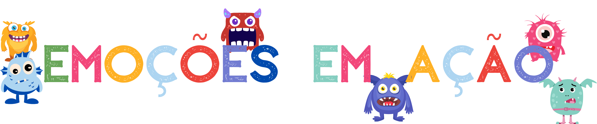

<h1 align="center">
<br>
  
<br>
<br>
</h1>

<p align="center">Jogo emoções em ação</p> 
 <p align="center">Jogo para crianças desenvolverem suas emoções em sala de aula</p>

<p align="center">
  <a href="https://github.com/FelipenKniess/ignews/blob/main/LICENSE">
    
  </a>  
</p>

## 🎯 Sobre

<p>O objetivo do jogo é desenvolver as emoções das crianças através da brincadeira e gamificação
</p>

## 🚀 Tecnologias utilizadas
- [Typescript](https://www.typescriptlang.org/)
- [Vite React](https://vitejs.dev/)
- [Chackra UI](https://chakra-ui.com/)
- [Roullete](https://www.npmjs.com/package/react-custom-roulette)


## :fire: Link do jogo
- https://game-emocoes-em-acao.vercel.app/

## :octocat: Execução da aplicação em desenvolvimento
- Requisítos: Instalar [Git](https://git-scm.com/), [Node](https://nodejs.org/en/), [Yarn](https://yarnpkg.com/)
- Baixar o repositório na máquina e entrar no projeto:
```bash
$ git clone https://github.com/FelipenKniess/game-emocoes-em-acao.git
$ cd game-emocoes-em-acao
```
- baixar as dependências do projeto e executar o projeto:
```bash
$ yarn
$ yarn dev
```
